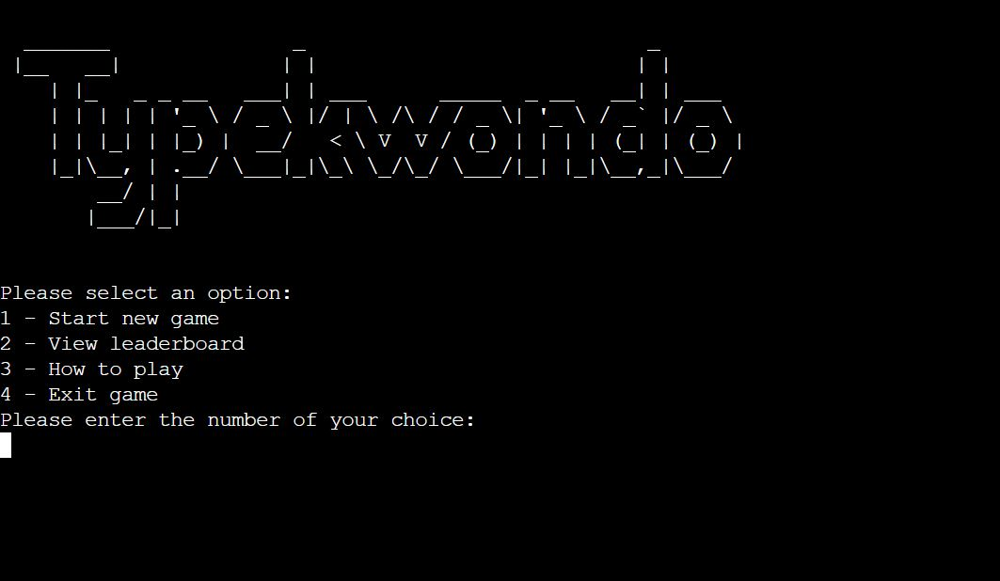

# TypeKwondo!

Welcome to TypeKwondo! 

As all developers will tell you, being able to type quickly and accurately is an invaluable skill. Not staring at your index fingers whilst trying to work out where the missing semi-colon is actually really useful.

And what do developers love? Gamification! Introducing TypeKwondo, where you get to improve your typing skills, whilst competitively playing a typing game in a theme of your choosing. On top of this, you can also compare your scores with the leaderboard and try and make it into the top 5 best typers ever (*not an official title) 

You can visit the live website [here](https://typekwondo.herokuapp.com/)

# Contents

# UX

## Project Goals

* Create a user-friendly program.
* Create a game that is straight forward to start, play and restart.
* Create a game that has additional benefits to the user.
* Ensure that questions are randomised and not repeated
* Provide the user with feedback on their progress through the program and through the game. 
* Catch all incorrect inputs that may break the program
* Give the user a choice of difficulty setting
* Give the user a choice of questions
* Create a database for the storage of user scores
* Provide the user with their score as well as the top 5 scores of all users.

## User Stories

* As a user visiting the site for the first time, I want to be able to navigate the program intuitively.
* As a user visiting the site for the first time, I want to be able to play the game quickly and easily. 
* As a user, I want to be provided with feedback such as correct answers.
* As a user, I want to be able to choose a theme of questions.
* As a user, I want to be able to set the difficulty of the quiz
* As a user, I want the questions to be randomised to keep the game interesting.
* As a user, I do not want to break the program by putting in unexpected inputs.

## Target Audience

The target audience of this website is any person who :

* enjoys games
* want to improve their typing ability

## Structure

The program is designed to be quick and easy to play:

- Welcome page - This contains a ASCII art title and the menu options.
- How to play page - This provides details on how to play the game
- Leaderboard page - This provides the a leaderboard of the top 5 userscores
- Options pages - The user is given the choice of difficulty and question theme
- Game page - The user is shown a word to type. The score and lives are shown after each question

## Skeleton

The initial ideas were taken from the structure planning and a process tree was created using [app.diagram.net](app.diagram.net)[here.](assets/images/processtree.JPG). 

# Features

## Existing Features

### Game container

- All content appears within a container that has a background image of a light wood to match that of an Ema. If this background image cannot load, a background colour has been added which has been plucked from the image. The container has a maximum absolute size to make sure that at full screen it bears resemblance to an Ema and a maximum relative size to ensure that you can always see the background image on all screen sizes. It additionally has a border style and shadow to give it the 3d look you would expect from a wooden tile.

### Header

- Logo "JapanEasy" in large unmissable font sets the tone of the website. The Logo is a hyperlink back to the homepage in keeping with current web standards. This is consistent on every page

The header becomes underlines when hovered over.

 -->

### Footer

- The Footer contains links to the "JapanEasy" social media websites. These open to a new tab upon click. These are consistent on every page

 -->

### Background

- Background image - This is a full screen size image of a lots of Ema which will have been hung in a temple. Ema are praying or wishes written upon a piece of wood. This is the background image for all pages. There are two version of the image of different resolutions which will load depending on your screensize to optimize speed.

### Introduction, explanation and choices

 - You are welcomed with a short and concise introduction and explanation of what to do followed by a couple of radio buttons. These are the options for the game. You can either have the questions in Hiragana and the answers in English or Vice versa. All questions and answers are completely randomised to ensure that the syllabary is learnt rather than the questions.

 The difficulty can be selected as easy, medium or hard. Easy gives 3 answers to choose from, medium gives 6 and hard gives 9.

 -->

### Buttons

- All buttons on the site provide user feedback by taking on the red border when hovered over.

### Quiz page

- The layout of the quiz is a question, which is either English or Hiragana, followed by answer tiles; the number of which depends on the difficulty setting.
- Score counters runs along the bottom that displays the number of correct answers given as well as incorrect.
- All answer tiles provide feedback with the consistent red border on hover.
- When an answer is chosen, if it is correct, the background of the tile will turn green, and if incorrect, the background of the tile will turn red.
- The quiz will run through the whole syllabary, however you can choose to end the game at any time with the "End Game" button which will take you to the end game page.

### End Game page

- When you click to end the game or complete the syllabary to are taken to an end game screen which provided you with the number of answers correctly answered out of the number of questions.
- Feedback is provided dependent on the score.
- A "try again" button returns you to the home page where you can make your choices again and start the quiz again.

 

### Python functionality

## Features to implement in the future

- Add additional syllabaries such as Katakana and eventually Kanji

## Technologies Used

 ### Languages Used:

 1. [Python](https://en.wikipedia.org/wiki/Python) 
 - Programming language providing content and logic of project
 
 ### Frameworks, Libraries & Programs Used:

    
 1. [GitPod](https://gitpod.io/)
    - IDE (Integrated Development Environment), for writing, editing and saving code.

 2. [GitHub](https://github.com/) 
    - Remote hosting platform and code repository.

3. [app.diagram.net](app.diagram.net)
    - Used to create process diagram. 

## Testing

The testing process can be seen in the [TESTING.md](TESTING.md) document.

## Deployment

### Heroku
The site is hosted using Heroku, deployed directly from the master branch of GitHub. The deployed site will update automatically as new commits are pushed to the master branch.

#### How I deployed my project to Heroku.
To host on Heroku you must follow these steps:

#### Updating dependencies for Heroku deployment

1. Create a requirements.txt file in the home directory of project
2. In the terminal write : pip3 freeze > requirements.txt

#### Creating a Heroku App

1. Go to [Heroku](https://www.heroku.com/)
2. Login to my account.
3. On the Heroku dashboard click on 'New'
4. Click on 'Create new app"
5. Input the app name 
6. Select region
6. Click "Create app"
7. Reload the page. Scroll back to 'GitHub Pages' section, where the new URL for the deployed site can be found.

#### Input settings

1. Click on "Reveal Config Vars"
2. In the field for key, enter "CREDS"
3. Copy contents of creds.json into the corresponding value field.
4. In the next field for key, enter "PORT"
5. In the corresponding value field enter "8000"
6. Click "Add buildpack"
7. Click "Python" and then "save changes"
8. Click "Add buildpack"
9. Click "nodejs" and then "save changes". 
10. Ensure these build packs are listed in the order above.

#### Deploy section

1. Click on Github under deployment method
2. Search for repository and then click on "connect"
3. Click on "Enable Automatic Deploys"

#### Forking a GitHub Repository
1. Login to GitHub.
2. Locate your desired repository.
3. Locate the fork option in the top-right hand corner of the repository page.    
4. You will be asked where you want to fork it to.

## Credits

### Code

https://stackoverflow.com/questions/2084508/clear-terminal-in-python

### Content

- All content written is my own and based on my own experiences learning Hiragana and what I would have found more helpful. I took inspiration from all the main Hiragana websites such as 

### Thanks

- to tutor support at Code Institute. I have constantly found their positivity and genuine interest in helping resolve issues in my code a great help 
- to my mentor who reviewed my project and gave feedback.
- to my partner who travelled Japan with me and gave me the inspiration to make this project. 