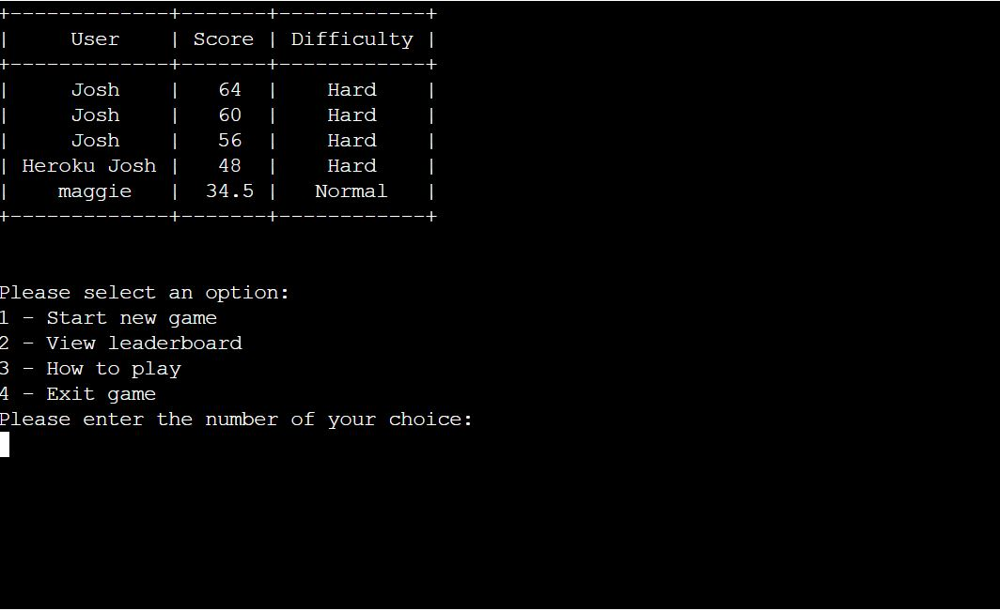
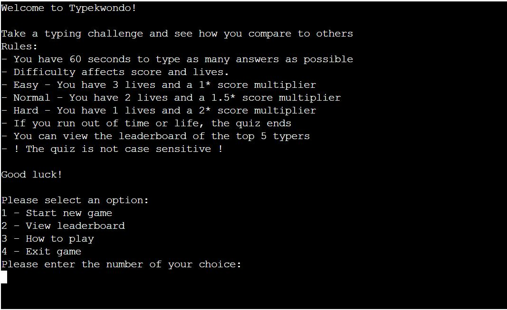
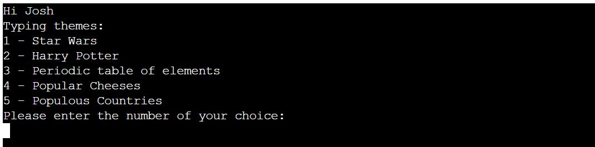
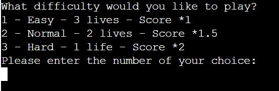

# TypeKwondo!

Welcome to TypeKwondo! 

As all developers will tell you, being able to type quickly and accurately is an invaluable skill. Not staring at your index fingers whilst trying to work out where the missing semi-colon is actually really useful.

And what do developers love? Gamification! Introducing TypeKwondo, where you get to improve your typing skills, whilst competitively playing a typing game in a theme of your choosing. On top of this, you can also compare your scores with the leaderboard and try and make it into the top 5 best typers ever (*not an official title) 

You can visit the live website [here](https://typekwondo.herokuapp.com/)

# Contents

# UX

## Project Goals

* Create a user-friendly program.
* Create a game that is straight forward to start, play and restart.
* Create a game that has additional benefits to the user.
* Ensure that questions are randomised and not repeated
* Provide the user with feedback on their progress through the program and through the game. 
* Catch all incorrect inputs that may break the program
* Give the user a choice of difficulty setting
* Give the user a choice of questions
* Create a database for the storage of user scores
* Provide the user with their score as well as the top 5 scores of all users.

## User Stories

* As a user visiting the site for the first time, I want to be able to navigate the program intuitively.
* As a user visiting the site for the first time, I want to be able to play the game quickly and easily. 
* As a user, I want to be provided with feedback such as correct answers.
* As a user, I want to be able to choose a theme of questions.
* As a user, I want to be able to set the difficulty of the quiz
* As a user, I want the questions to be randomised to keep the game interesting.
* As a user, I do not want to break the program by putting in unexpected inputs.

## Target Audience

The target audience of this website is any person who :

* enjoys games
* want to improve their typing ability

## Structure

The program is designed to be quick and easy to play:

- Welcome page - This contains a ASCII art title and the menu options.
- How to play page - This provides details on how to play the game
- Leaderboard page - This provides the a leaderboard of the top 5 userscores
- Options pages - The user is given the choice of difficulty and question theme
- Game page - The user is shown a word to type. The score and lives are shown after each question

## Skeleton

The initial ideas were taken from the structure planning and a process tree was created using app.diagram.net [here.](assets/images/processtree.JPG). 

# Features

## Existing Features

### Home page and menu

- Contains ASCII art title of the game
- Gives the user 4 options; 
    1. To start a new game
    2. View leaderboard
    3. How to play
    4. Exit game
- If you do not enter one of the corresponding numbers, you will be told what you have entered and asked to enter the number of one of the options provided

### Leaderboard

- Prettytable library has been imported and used for the structure of the table.
- The leaderboard consists of three columns; User, Score and Difficulty.
- The data from the leaderboard is pulled from the googlesheets database.
- You are also provided with the menu options.

 -->

### How to play

- How to play explains the different elements of the game as well as the scoring structure
- The menu options are also provided for continuation

 -->

### Enter name

- You are asked to enter your name
- You are then asked if this is correct
- If you do not answer yes or no to whether it is correct, you are redirected to answer the question again. You are told what you have entered.
- Once you select your name, the console prints out Hi and your name

### Difficulty and quiz theme choices

 - The quiz provides 3 different quiz types: Star Wars, Harry Potter and Periodic table of elements.
 - You are asked to choose which you would like to play.
 - The difficulty setting is next requested. You can choose easy, normal or hard. Easy applies a 1* score multiplier, normal is 1.5* and hard is 2*. Additionally if you play on normal you have 3 lives, normal you have 2 and hard you have 1.
  - Incorrect input is captured and directed back to the user

 -->
 -->

### Quiz

- All buttons on the site provide user feedback by taking on the red border when hovered over. 

### Python functionality

### Data and Database

## Features to implement in the future

- Add additional question sets
- Add a superhard difficulty setting that is case sensitive
- Add a variant where the word you have to spell is hidden after a second.

## Technologies Used

 ### Languages Used:

 1. [Python](https://en.wikipedia.org/wiki/Python) 
 - Programming language providing content and logic of project
 
 ### Frameworks, Libraries & Programs Used:

    
 1. [GitPod](https://gitpod.io/)
    - IDE (Integrated Development Environment), for writing, editing and saving code.

 2. [GitHub](https://github.com/) 
    - Remote hosting platform and code repository.

3. [app.diagram.net](app.diagram.net)
    - Used to create process diagram. 

## Testing

The testing process can be seen in the [TESTING.md](TESTING.md) document.

## Deployment

### Heroku
The site is hosted using Heroku, deployed directly from the master branch of GitHub. The deployed site will update automatically as new commits are pushed to the master branch.

#### How I deployed my project to Heroku.
To host on Heroku you must follow these steps:

#### Updating dependencies for Heroku deployment

1. Create a requirements.txt file in the home directory of project
2. In the terminal write : pip3 freeze > requirements.txt

#### Creating a Heroku App

1. Go to [Heroku](https://www.heroku.com/)
2. Login to my account.
3. On the Heroku dashboard click on 'New'
4. Click on 'Create new app"
5. Input the app name 
6. Select region
6. Click "Create app"
7. Reload the page. Scroll back to 'GitHub Pages' section, where the new URL for the deployed site can be found.

#### Input settings

1. Click on "Reveal Config Vars"
2. In the field for key, enter "CREDS"
3. Copy contents of creds.json into the corresponding value field.
4. In the next field for key, enter "PORT"
5. In the corresponding value field enter "8000"
6. Click "Add buildpack"
7. Click "Python" and then "save changes"
8. Click "Add buildpack"
9. Click "nodejs" and then "save changes". 
10. Ensure these build packs are listed in the order above.

#### Deploy section

1. Click on Github under deployment method
2. Search for repository and then click on "connect"
3. Click on "Enable Automatic Deploys"

#### Forking a GitHub Repository
1. Login to GitHub.
2. Locate your desired repository.
3. Locate the fork option in the top-right hand corner of the repository page.    
4. You will be asked where you want to fork it to.

## Credits

### Code

- Code lines 19 - 30 regarding connecting googlesheets APIs adapted from Code Institute LMS 
- Clear screen function code adapted from stackoverflow [here](https://stackoverflow.com/questions/2084508/clear-terminal-in-python)

### Thanks

- to tutor support at Code Institute. I have constantly found their positivity and genuine interest in helping resolve issues in my code a great help 
- to my mentor, Richard Wells, who reviewed my project and gave feedback.
- to my partner who is always willing to test everything I create 